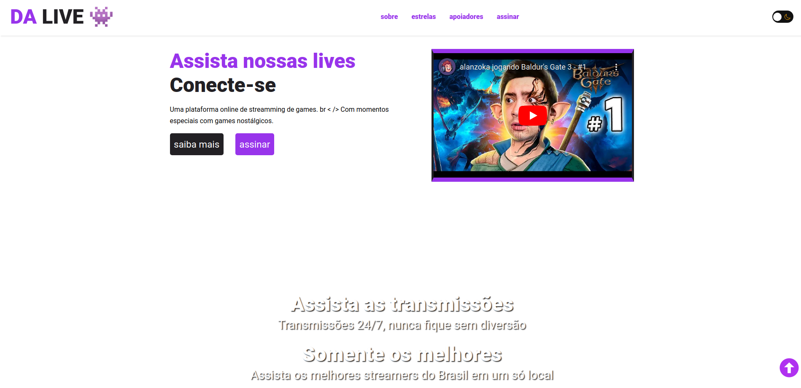

<h1 align="center">
  DA LIVE &#x1f47e;
</h1>

  
  
  
  
  

  
  
  

  

### 💻 Projeto

**Da Live** - Site para mostrar os maiores streamers mundiais e nacionais da atualidade (WEB I)

**🚀Tecnologias:**

- [HTML5](https://developer.mozilla.org/pt-BR/docs/Web/HTML)
- [CSS3](https://developer.mozilla.org/pt-BR/docs/Web/CSS)
- [VSCode](https://code.visualstudio.com)
- [Git](https://git-scm.com)

**💡Commit:**

- 📦 Create - _Funcionalidades novas_
- 📤 Update - _Atualizações de códigos_
- 🐞 Bug - _Correções de Bugs_
- 🚩 Realese - _Versões do projeto_
